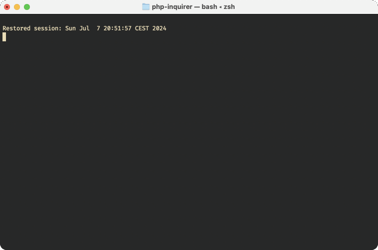

# PHP Inquirer

Beautiful interactive CLI prompts for PHP, based on the Rust [inquire](https://github.com/mikaelmello/inquire) crate.

## Demo
```php
$name = Text::make()->prompt('Name')->placeholder('John Doe')->run();
$password = Password::make()->prompt('Password')->confirm()->run();
$birthday = Date::make()->prompt('Birthday')->maxDate(date('Y-m-d'))->run();
$whitespace = Select::make()->prompt('Indentation')->options(['Tabs', 'Spaces'])->run();
$hobbies = MultiSelect::make()->options(['Programming', 'Music', 'Cooking'])->initial(['Programming'])->run();
$bio = Editor::make()->prompt('Your Bio')->hint('Close editor when finished')->run();
$confirm = Confirm::make()->prompt('Proceed')->default(true)->run();

echo json_encode(compact('name', 'password', 'birthday', 'whitespace', 'hobbies', 'bio', 'confirm'), JSON_PRETTY_PRINT);
```


## About
This is a simple proof of concept. I like the interactive prompts provided by the inquire crate,
and I wanted to see what it took to use them in PHP CLI scripts.

This package includes a simple Rust cli app, pre-compiled for Linux, Mac and Windows.
The PHP library is a simple wrapper that calls the rust app using `exec()`. I wanted to use
`symfony/process`, but I couldn't find a way to make it fully interactive, while also being able to capture
the output and exit code.

Caveat about the `Editor` prompt: By default it uses the editor defined in `EDITOR` or `VISUAL` (falls back to `nano`).
Unfortunately this wrapper doesn't support terminal editors, but using a GUI editor like vscode does work.
To use VS Code as the editor, either `export VISUAL=code` or run the editor with `->program('code')`.

If you have suggestions, please open an issue or submit a PR.
